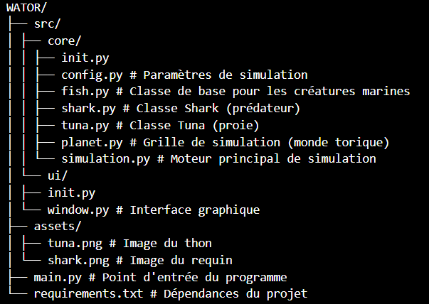
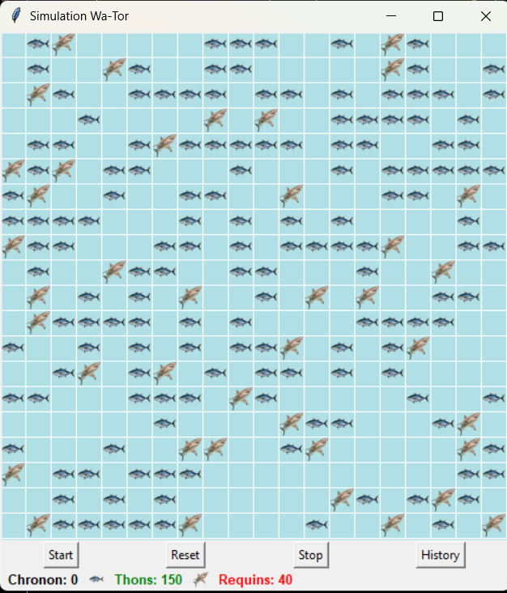

# 🌊  Projet Wa-Tor – Simulation d'écosystème marin
## 📁 Structure du projet

Wa-Tor est une simulation d’écosystème marin où thons (tuna) et requins (sharks) interagissent sur une grille torique (le monde "boucle" sur lui-même comme un globe).

L'objectif est d'observer l'évolution des populations et l'équilibre naturel entre proies et prédateurs.

### 🐟 Les Thons (Tuna)
Rôle : Proies

Comportement :

- Se déplacent aléatoirement vers une case vide voisine.

- Se reproduisent après un certain nombre de chronons (TUNA_REPRODUCTION_TIME).

- Ne meurent pas de faim.

### 🦈 Les Requins (Shark)
Rôle : Prédateurs

Comportement :

- Cherchent à se déplacer vers une case contenant un thon (qu’ils mangent).

- Si aucun thon n’est adjacent, se déplacent vers une case vide.

- Se reproduisent après SHARK_REPRODUCTION_TIME.

- Meurent de faim.

### ⏱️ Chronons
Un chronon représente une unité de temps dans la simulation.

- À chaque chronon :

- Chaque entité agit (déplacement, reproduction, ou mort).

- La grille est mise à jour.

- Des statistiques peuvent être collectées : nombre de thons, de requins, etc.

### 🔁 Environnement toroïdal
La grille est fermée sur elle-même :

- Aller à droite du bord droit revient à gauche.

- Monter au bord supérieur revient en bas.

- Cela empêche les entités de sortir de la grille.

## 🎯 Objectif de la Simulation
- Observer les dynamiques de population : croissance, décroissance, extinction.

- Analyser l’impact des paramètres : Taux de reproduction, Taille de la grille...

- Comprendre les équilibres naturels dans un écosystème simple.
## 🦈🐟 Simulation réalisée

